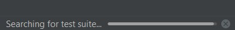
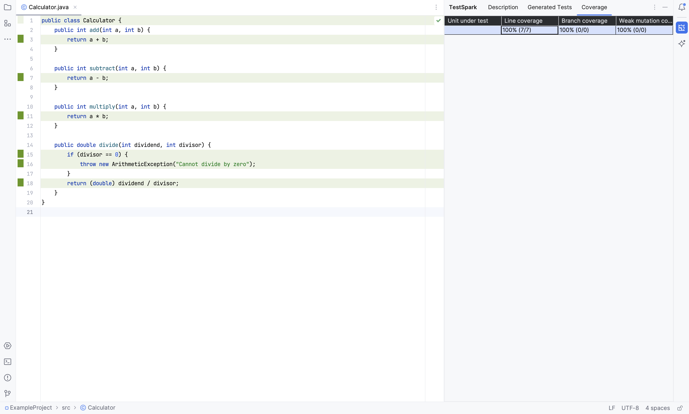
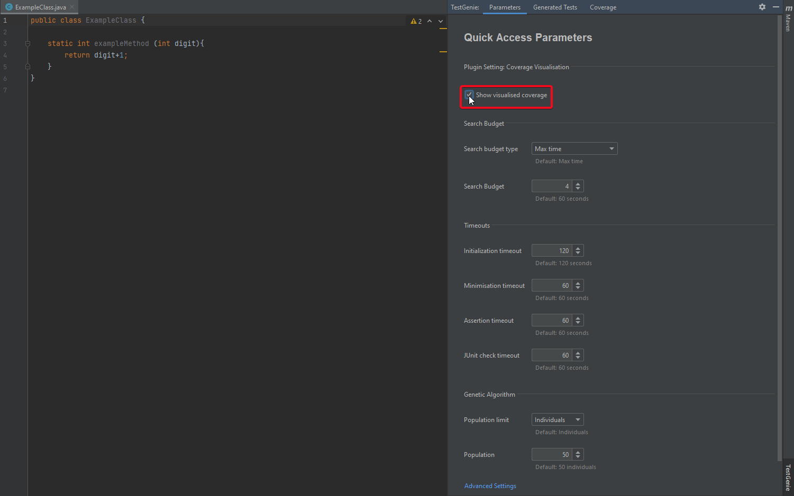
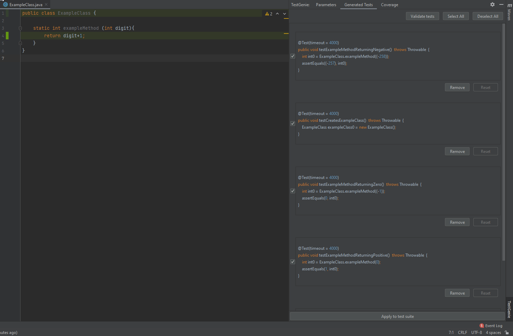
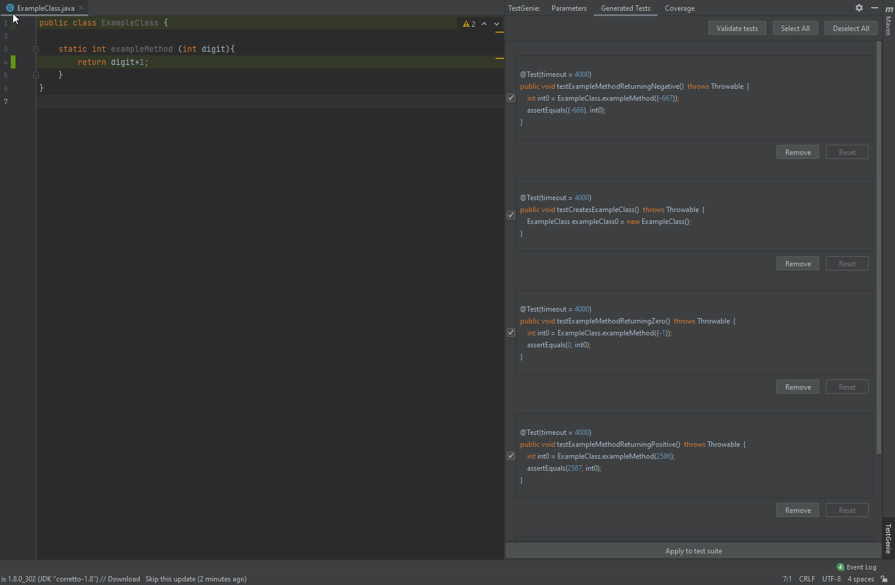
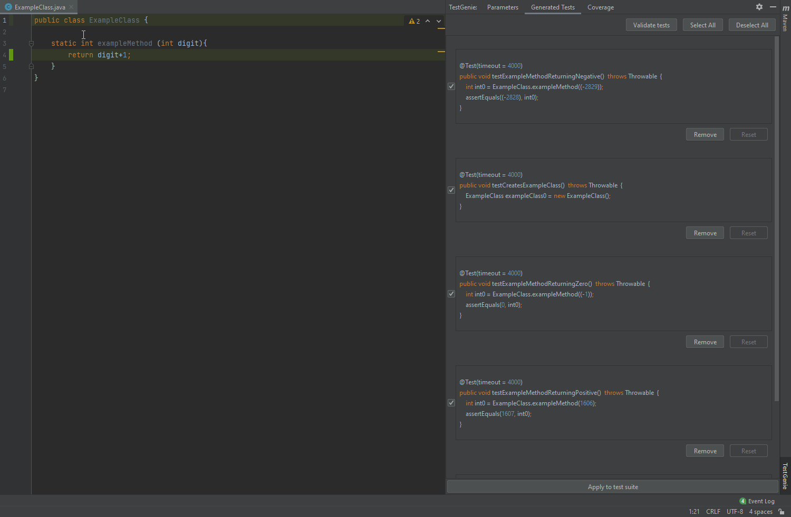
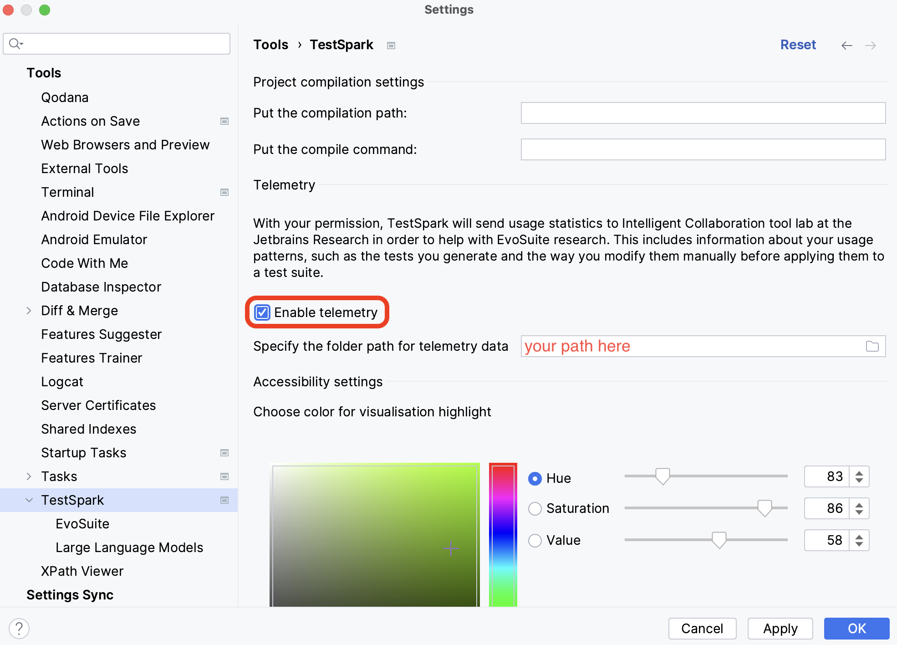
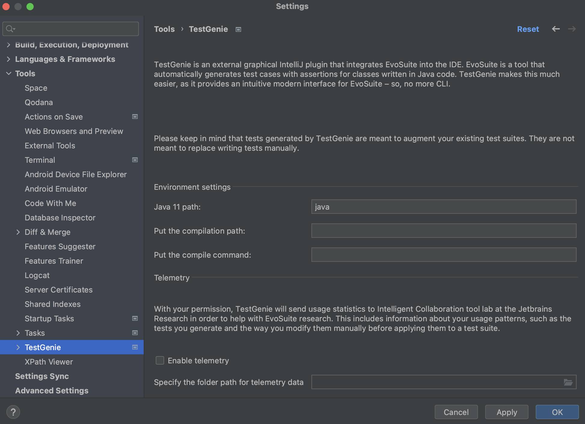
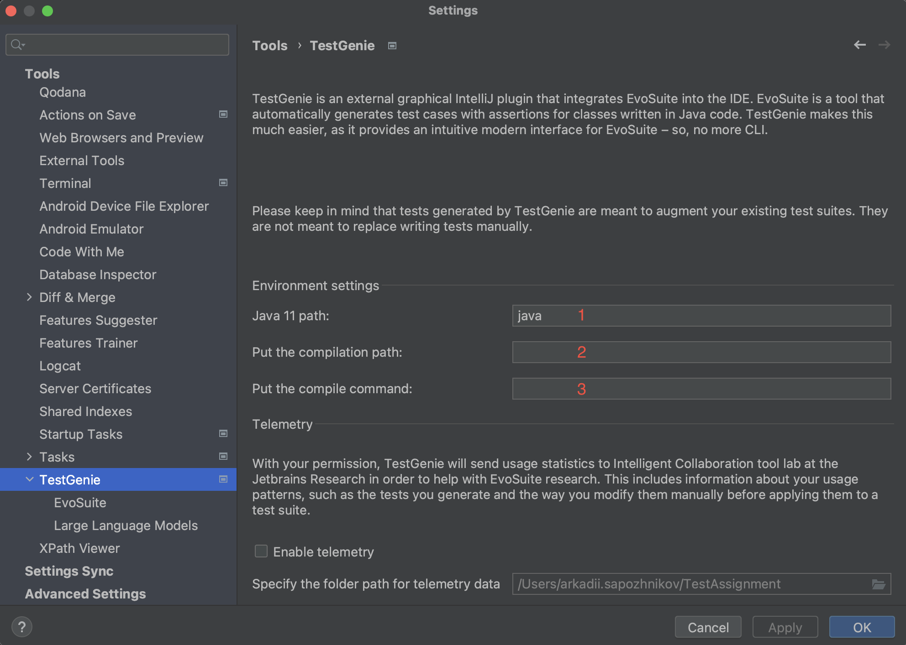
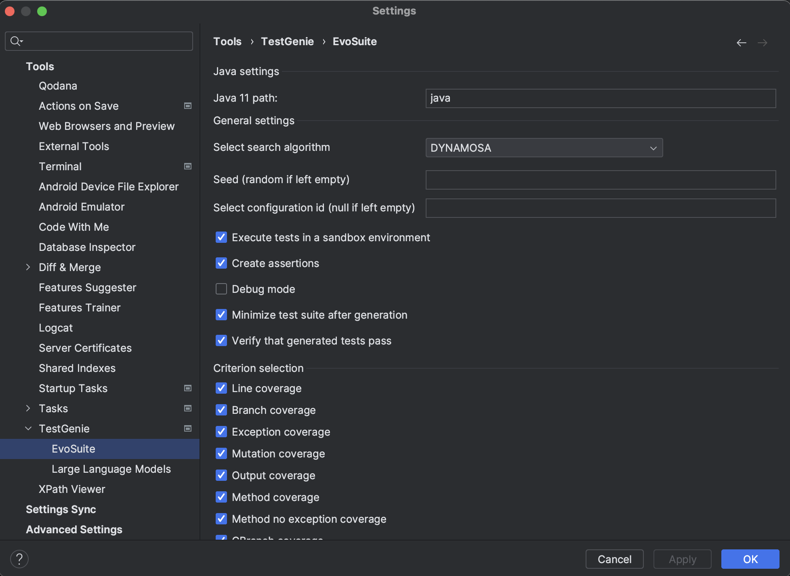

# TestGenie

## Description

<!-- Plugin description -->
TestGenie is an external graphical IntelliJ plugin that integrates EvoSuite into the IDE. [EvoSuite](https://www.evosuite.org/) is a tool that automatically generates test cases with assertions for classes written in Java code. TestGenie makes this much easier, as it provides an intuitive modern interface for EvoSuite – so, no more CLI.

This specific section is a source for the [plugin.xml](/src/main/resources/META-INF/plugin.xml) file which will be extracted by the [Gradle](/build.gradle.kts) during the build process.

<!-- Plugin description end -->

## Features
<!-- What features are supported by the plugin? -->
- [EvoSuite is installed with the plugin](#installation)
- [Automatic test generation for classes](#generating-tests-for-classes-1)
- [Automatic test generation for methods](#generating-tests-for-methods)
- [Automatic test generation for lines](#generating-tests-for-lines-1)
- [Coverage table](#coverage-table-1)
- [Coverage visualisation for generated test suite](#coverage-visualisation-1)
- [Killed mutants visualisation](#killed-mutants-visualisation-1)
- [Caching tests](#caching-tests-1)
- [Test validation](#test-validation-1)
- [Accessibility features](#accessibility-features-1)
- [Telemetry](#telemetry-opt-in-1)
- Assertion generation for selected tests (_to be implemented_)
- Interactive Learning (_to be implemented_)
- Smart Variable Name Generation (_to be implemented_)

### Generating Tests for Classes
TestGenie uses EvoSuite to automatically generate tests for Java classes. Two clicks are required from the user for the tests to be generated.

### Generating Tests for Methods
TestGenie uses EvoSuite to automatically generate tests for Java methods. Two clicks are required from the user for the tests to be generated.

### Generating Tests for Lines
TestGenie uses EvoSuite to automatically generate tests for Java code lines. Two clicks are required from the user for the tests to be generated.

### Coverage Table
Basic statistics for the test suite in form of a table.

### Coverage Visualisation
TestGenie offers an option to highlight lines which the generated test suite covers. Clicking the gutter icon (green rectangle) to the left of the lines allows the user to see which tests cover the line. Clicking a name of a test highlights the according test in the "Generated Tests" tab to make it easy to spot.

### Killed Mutants Visualisation
TestGenie offers an option to see which mutants were killed and by which tests. Clicking the gutter icon (green rectangle) to the left of the lines allows the user to see which tests cover the line. Clicking a name of a mutant highlights all the tests in the "Generated Tests" tab which cover it.

### Caching Tests
Due to its nature, generating tests with EvoSuite takes time. TestGenie takes steps to address this as
much as technically feasible by caching all generated test cases that the user has decided not to apply
immediately. This then allows TestGenie to instantly show those tests later, when the user decides to
generate tests for a method or class that those unapplied tests also covered.

### Test validation
To assure that the cached tests are still valid, we have static and dynamic validation which are run before showing any cached tests.

### Accessibility Features
Features which make the plugin more user-friendly. For instance, a color picker for coverage visualisation.

### Telemetry (opt-in)
Opt-in non-intrusive data collection to improve EvoSuite in the future.

### Assertion Generation
*To be implemented. Currently, not supported*

### Interactive Learning
*To be implemented. Currently, not supported*

### Smart Variable Name Generation
*To be implemented. Currently, not supported*

## Installation

- Using IDE built-in plugin system:
  
  <kbd>Settings/Preferences</kbd> > <kbd>Plugins</kbd> > <kbd>Marketplace</kbd> > <kbd>Search for "TestGenie"</kbd> >
  <kbd>Install Plugin</kbd>
  
- Manually:

  Download the [latest release](https://github.com/ciselab/TestGenie/releases/latest) and install it manually using
  <kbd>Settings/Preferences</kbd> > <kbd>Plugins</kbd> > <kbd>⚙️</kbd> > <kbd>Install plugin from disk...</kbd>

## Usage
<!-- How to use the plugin? What are the limitations? Are there any shortcuts? -->
### <u>Important note before generating tests</u>
If you are running the plugin for the first time, checkout the [`First time configuration`](#first-time-configuration) section.

### Generating Tests for Classes
To generate a test for a class, right-click (with mouse) anywhere within the class you want to test or right-click the class name itself (note that when using multiple cursors only the last one will count). Under the "TestGenie" option, select "Generate Tests for Class [...]" option:\
\
 EvoSuite going to run in the background and generate tests. While EvoSuite is running, a progress bar in the bottom right-hand corner of the IDE:\
\
Once the tests are generated, they can be accessed in the "TestGenie" tool window (under "Generated Tests" tab), accessible via the stripe button on the right-hand side of the IDE:\
\
You can examine the created tests, select those you wish to be added to your test class (via checkboxes). The tests can also be edited inside their mini-editors. Hitting the "Apply to test suite" button will add the selected tests to a test class of your choice.

### Generating Tests for Methods
To generate a test for a method, right-click (with mouse) anywhere within the method you want to test or right-click the method name itself (note that when using multiple cursors only the last one will count). Under the "TestGenie" option, select "Generate Tests for Method [...]" option:\
\
 EvoSuite going to run in the background and generate tests. While EvoSuite is running, a progress bar in the bottom right-hand corner of the IDE:\
\
Once the tests are generated, they can be accessed in the "TestGenie" tool window (under "Generated Tests" tab), accessible via the stripe button on the righthand-side of the IDE:\
\
You can examine the created tests, select those you wish to be added to your test class (via checkboxes). The tests can also be edited inside their mini-editors. Hitting the "Apply to test suite" button will add the selected tests to a test class of your choice.

### Generating Tests for Lines
To generate a test for a method, right-click (with mouse) anywhere within the line you want. Note that the line has to contain a statement (e.g. you will not have the option on lines with only method declarations). Under the "TestGenie" option, select "Generate Tests for Line [...]" option:\
\
 EvoSuite going to run in the background and generate tests. While EvoSuite is running, a progress bar in the bottom right-hand corner of the IDE:\
\
Once the tests are generated, they can be accessed in the "TestGenie" tool window (under "Generated Tests" tab), accessible via the stripe button on the righthand-side of the IDE:\
\
You can examine the created tests, select those you wish to be added to your test class (via checkboxes). The tests can also be edited inside their mini-editors. Hitting the "Apply to test suite" button will add the selected tests to a test class of your choice.

### Coverage Table
Once a test suite is generated, basic statistics about it can be seen in the tool window, `coverage` tab. The statistics include line coverage, branch coverage, weak mutation coverage. The table adjusts dynamically - it only calculates the statistics for the selected tests in the test suite.\

### Coverage Visualisation
For coverage visualisation to work, you must have it turned on. The setting is available in the <kbd>Quick Access</kbd> tab.
\
Once test are generated, the lines which are covered by the tests will be highlighted (default color: green). The gutter next to the lines will have a green rectangle as well. If the rectangle is clicked, a popup will show the names of the tests which cover the selected line. If any of the test names are clicked, the corresponding test in the toolwindow will be highlighted with the same accent color. The effect lasts 10 seconds. Coverage visualisation adjusts dynamically - it only shows results for the tests that are selected in the TestGenie tab.\
\
For reference, without visualisation the window would look like this:\

### Killed Mutants Visualisation
For mutation visualisation to work, you must have [coverage visualisation](#coverage-visualisation-1) enabled. You must also have the criterion `Mutation coverage` turned on. The setting is available in the <kbd>Settings</kbd> > <kbd>Tools</kbd> > <kbd>TestGenie</kbd> > <kbd>EvoSuite</kbd> tab.\
\
Once tests are generated, the same gutter from [`Coverage Visualisation`](#coverage-visualisation-1) can be used to show which mutants are covered by the current test suite and which ones are not. For mutants covered, the mutant can be clicked. Clicking the mutant will highlight all the tests that kill the mutant. Mutation visualisation adjusts dynamically - it only shows results for the tests that are selected in the TestGenie tab.\

### Caching Tests
When a user initially generates tests for a class, this will take some time, as the EvoSuite backend needs to be invoked. Then, if a user generates tests for a single method in this class, Test-Genie will look in its cache and find the tests that were previously generated for the entire class, and will instantly display them to the user rather than invoking EvoSuite again.\
Before displaying cached tests, they are (in)validated [statically and dynamically](#test-validation-1).\

### Test validation
Tests which are no longer representative of the current state of the code under test are dropped from the cache, as they are no longer valid. We have 2 types of cache validation - static and dynamic validation. Static validation removes tests from cache by analysing the structure of the methods inside a class. If a method is modified, the tests covering it would be invalidated. Furthermore, it ignores whitespace changes, formatting inside a method and also reordering methods inside a class. Dynamic invalidation comes after static invalidation and verifies that all tests in the cache are still valid by running each of them. Failing tests are removed from the cache.

### Accessibility Features
- The plugin supports changing the color for [coverage visualisation](#coverage-visualisation-1) and [killed mutants visualisation](#killed-mutants-visualisation-1) (one setting for both). To change the color, go to <kbd>Settings</kbd> > <kbd>Tools</kbd> > <kbd>TestGenie</kbd> and use the color picker under `Accessibility settings`:\

- The plugin has been designed with translation in mind. The vast majority of the plugins labels, tooltips, messages, etc. is stored in <kbd>.property</kbd> files. For more information on translation, refer to the contributing readme.

### Telemetry (opt-in)
One of the biggest future plans of our client is to leverage the data that is gathered by TestGenie’s telemetry. This will help them with future research, including the development of an interactive way of using EvoSuite. The general idea behind this feature is to learn from the stored user corrections in order to improve test generation.\
To opt into telemetry, go to <kbd>Settings</kbd> > <kbd>Tools</kbd> > <kbd>TestGenie</kbd> and tick the `Enable telemetry` checkbox. If you want, change the directory where telemetry is stored.\

## Configuration
<!-- How can users configure the plugin to match their needs? -->
The plugin is configured mainly through the Settings menu. The plugin settings can be found under <kbd>Settings</kbd> > <kbd>Tools</kbd> > <kbd>TestGenie</kbd>. Here, the user is able to select options for the plugin:\

### First time configuration
Before running the plugin for the first time, we highly recommend going to the `Environment settings` section of TestGenie settings. The settings include java 11 path, compilation path (path to compiled code), compilation command. All commands have defaults. However, we recommend especially that you check compilation command. For this command the user requires maven, gradle or any other builder program which can be accessed via command. Leaving this field with a faulty value may cause unintended behaviour.

### Quick Access Parameters
<!-- How to use Quick Access Parameters tab? Where to find it? What can be changed? --> 
Some parameters for tweaking EvoSuite are used so often, that going to the settings menu gets annoying. That why these parameters were added (exclusively) to the Quick Access Panel of the TestGenie tool window (`Parameters` tab). These are settings so common/useful that they deserved their own spot:\
\
Pro tip: don't forget to hit the "save" button at the bottom.

### Advanced Parameters
<!-- How to use Advanced Parameters Settings entry? Where to find it? What can be changed? --> 
The settings submenu <kbd>Settings</kbd> > <kbd>Tools</kbd> > <kbd>TestGenie</kbd> > <kbd>EvoSuite</kbd> allows the user to tweak EvoSuite parameters to their liking. EvoSuite has hundreds of parameters, not all can be packed in a settings menu. However, the most commonly used and rational settings were added here:\

## Contribution
<!-- How to contribute to the plugin -->
The plugin is Open-Source and  publicly hosted on github. Anyone can look into the code and suggest changes. You can find the plugin page [here](https://github.com/ciselab/TestGenie). 
## Licence
<!-- Which licence does the plugin have -->

---
Plugin based on the [IntelliJ Platform Plugin Template][template].

[template]: https://github.com/JetBrains/intellij-platform-plugin-template
