# TestGenie

## Description

<!-- Plugin description -->
TestGenie is an external graphical IntelliJ plugin that integrates EvoSuite into the IDE. [EvoSuite](https://www.evosuite.org/) is a tool that automatically generates test cases with assertions for classes written in Java code. TestGenie makes this much easier, as it provides an intuitive modern interface for EvoSuite – so, no more CLI.

This specific section is a source for the [plugin.xml](/src/main/resources/META-INF/plugin.xml) file which will be extracted by the [Gradle](/build.gradle.kts) during the build process.

<!-- Plugin description end -->

## Features
<!-- What features are supported by the plugin? -->
- EvoSuite is installed with the plugin
- Automatic test generation for classes
- Automatic test generation for methods
- Automatic test generation for lines (_to be implemented_)
- Coverage visualisation for generated test suite
- Assertion generation for selected tests (_to be implemented_)
- Interactive Learning
- Smart Variable Name Generation (_to be implemented_)

### Generating Tests for Classes
TestGenie uses EvoSuite to automatically generate tests for Java classes. Two clicks are required from the user for the tests to be generated.

### Generating Tests for Methods
TestGenie uses EvoSuite to automatically generate tests for Java methods. Two clicks are required from the user for the tests to be generated.

### Generating Tests for Lines
*To be implemented. Currently, not supported*

### Coverage Visualisation
TestGenie offers an option to highlight lines which the generated test suite covers. Clicking the gutter icon (green rectangle) to the left of the lines allows the user to see which tests cover the line. Clicking a name of a test highlights the according test in the "Generated Tests" tab to make it easy to spot.

### Assertion Generation
*To be implemented. Currently, not supported*

### Interactive Learning
*To be implemented. Currently, not supported*

### Smart Variable Name Generation
*To be implemented. Currently, not supported*

## Installation

- Using IDE built-in plugin system:
  
  <kbd>Settings/Preferences</kbd> > <kbd>Plugins</kbd> > <kbd>Marketplace</kbd> > <kbd>Search for "TestGenie"</kbd> >
  <kbd>Install Plugin</kbd>
  
- Manually:

  Download the [latest release](https://github.com/ciselab/TestGenie/releases/latest) and install it manually using
  <kbd>Settings/Preferences</kbd> > <kbd>Plugins</kbd> > <kbd>⚙️</kbd> > <kbd>Install plugin from disk...</kbd>

## Usage
<!-- How to use the plugin? What are the limitations? Are there any shortcuts? -->
### <u>Important note before generating tests</u>
If you are running the plugin for the first time, checkout the `First time configuration` section.

### Generating Tests for Classes
To generate a test for a class, right-click (with mouse) anywhere within the class you want to test or right-click the class name itself (note that when using multiple cursors only the last one will count). Under the "TestGenie" option, select "Generate Tests for Class [...]" option:\
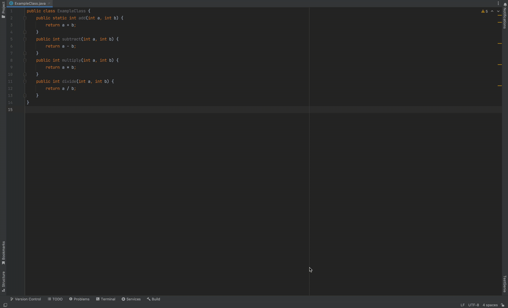\
 EvoSuite going to run in the background and generate tests. While EvoSuite is running, a progress bar in the bottom right-hand corner of the IDE:\
\
Once the tests are generated, they can be accessed in the "TestGenie" tool window (under "Generated Tests" tab), accessible via the stripe button on the right-hand side of the IDE:\
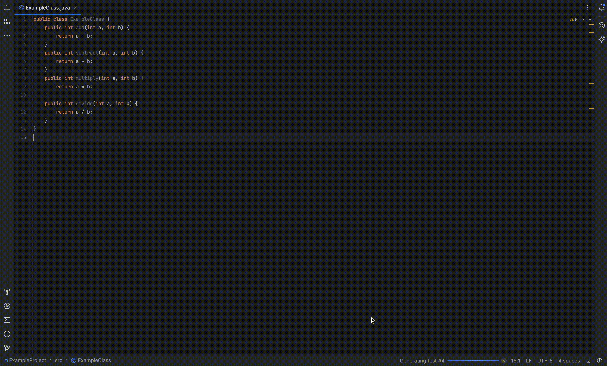\
You can examine the created tests, select those you wish to be added to your test class (via checkboxes). Hitting the "Apply to test suite" button will add the selected tests to a test class of your choice.

### Generating Tests for Methods
To generate a test for a method, right-click (with mouse) anywhere within the method you want to test or right-click the method name itself (note that when using multiple cursors only the last one will count). Under the "TestGenie" option, select "Generate Tests for Method [...]" option:\
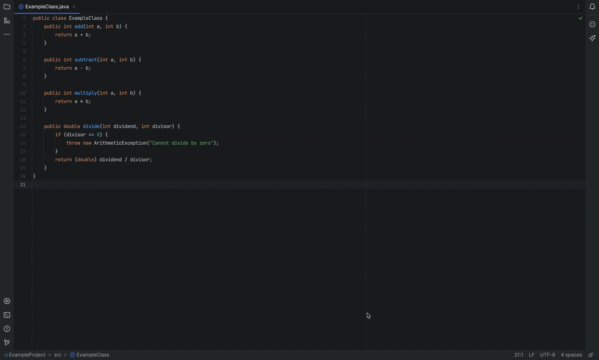\
 EvoSuite going to run in the background and generate tests. While EvoSuite is running, a progress bar in the bottom right-hand corner of the IDE:\
\
Once the tests are generated, they can be accessed in the "TestGenie" tool window (under "Generated Tests" tab), accessible via the stripe button on the righthand-side of the IDE:\
\
You can examine the created tests, select those you wish to be added to your test class (via checkboxes). Hitting the "Apply to test suite" button will add the selected tests to a test class of your choice.

### Generating Tests for Lines
To generate a test for a method, right-click (with mouse) anywhere within the line you want. Note that the line has to contain a statement (e.g. you will not have the option on lines with only method declarations). Under the "TestGenie" option, select "Generate Tests for Line [...]" option:\
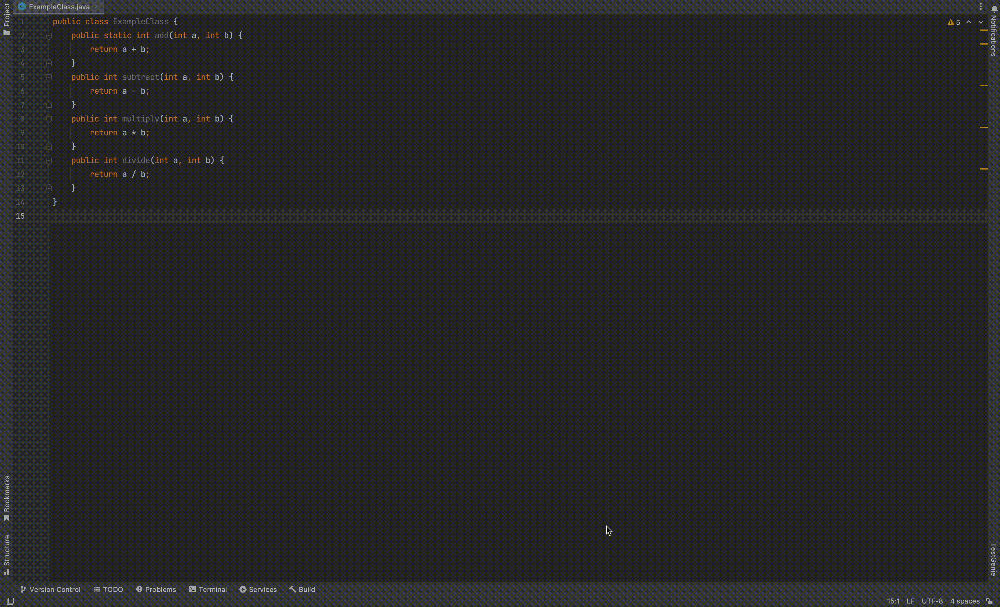\
 EvoSuite going to run in the background and generate tests. While EvoSuite is running, a progress bar in the bottom right-hand corner of the IDE:\
\
Once the tests are generated, they can be accessed in the "TestGenie" tool window (under "Generated Tests" tab), accessible via the stripe button on the righthand-side of the IDE:\
\
You can examine the created tests, select those you wish to be added to your test class (via checkboxes). Hitting the "Apply to test suite" button will add the selected tests to a test class of your choice.

### Coverage Visualisation
For coverage visualisation to work, you must have it turned on. The setting is available in `Settings` -> `Tools` -> `TestGenie` -> "Show visualised coverage":\
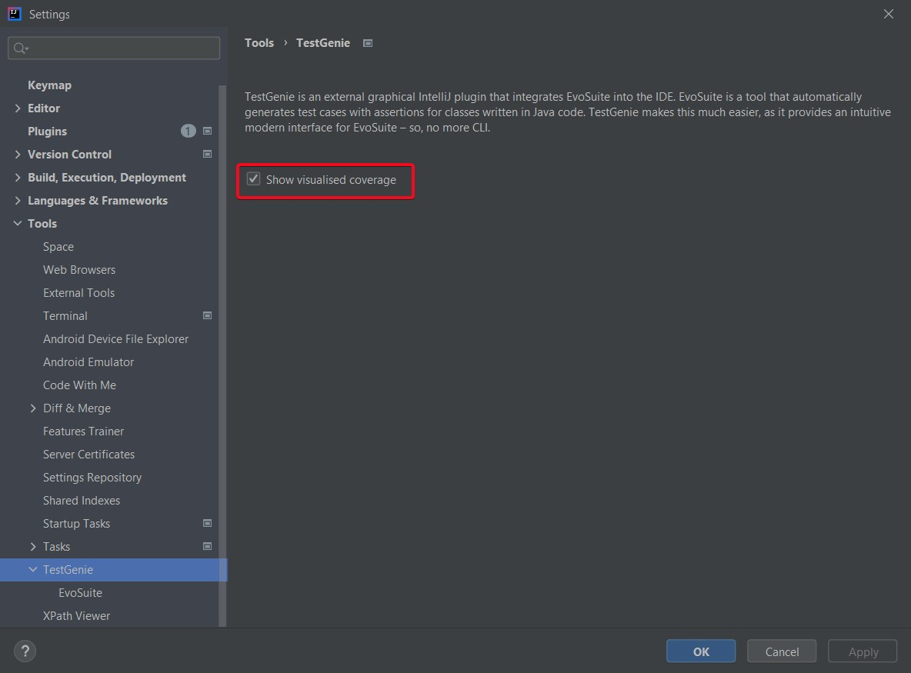\
Once test are generated, the lines which are covered by the tests will be highlighted (default color: green). The gutter next to the lines will have a green rectangle as well. If the rectangle is clicked, a popup will show the names of the tests which cover the selected line:\
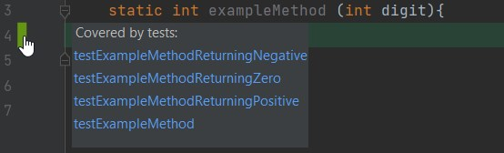\
If any of the test names are clicked, the corresponding test in the toolwindow will be highlighted with the same accent color:\
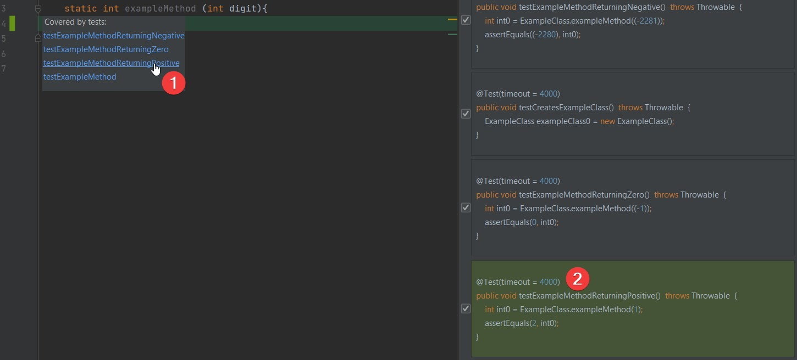\
The effect lasts 10 seconds.\
Statistics on code coverage can be found in the "Coverage Visualisation" tab, in the "TestGenie" toolwindow:\
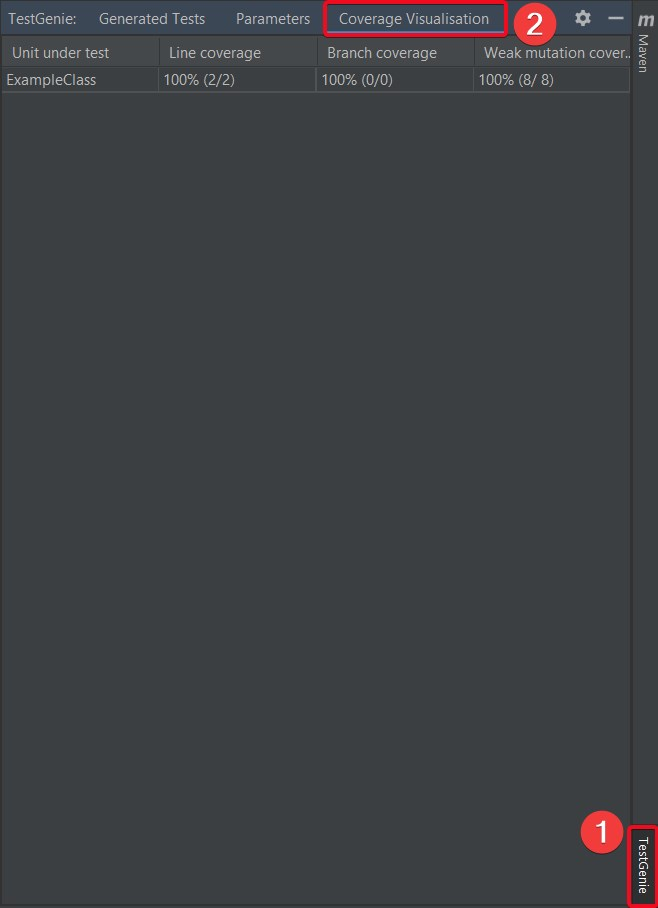

## Configuration
<!-- How can users configure the plugin to match their needs? -->
The plugin is configured mainly through the Settings menu. The plugin settings can be found under `Settings` -> `Tools` -> `TestGenie`. Here, the user is able to select options for the plugin:\
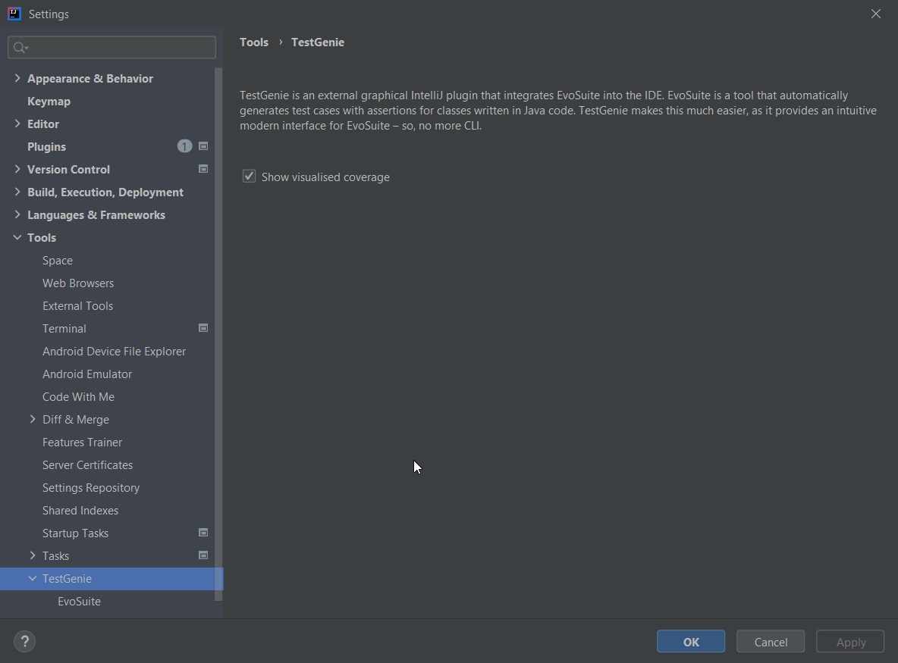

### First time configuration
Before running the plugin for the first time, we highly recommend going to the `Environment settings` section of TestGenie settings. The settings include java 11 path, compilation path (path to compiled code), compilation command. All commands have defaults. However, we recommend especially that you check compilation command. For this command the user requires maven, gradle or any other builder program which can be accessed via command. Leaving this field with a faulty value may cause unintended behaviour.

### Quick Access Parameters
<!-- How to use Quick Access Parameters tab? Where to find it? What can be changed? --> 
Some parameters for tweaking EvoSuite are used so often, that going to the settings menu gets annoying. That why these parameters were added (exclusively) to the Quick Access Panel of the TestGenie tool window ("Parameters" tab). These are settings so common/useful that they deserved their own spot:\
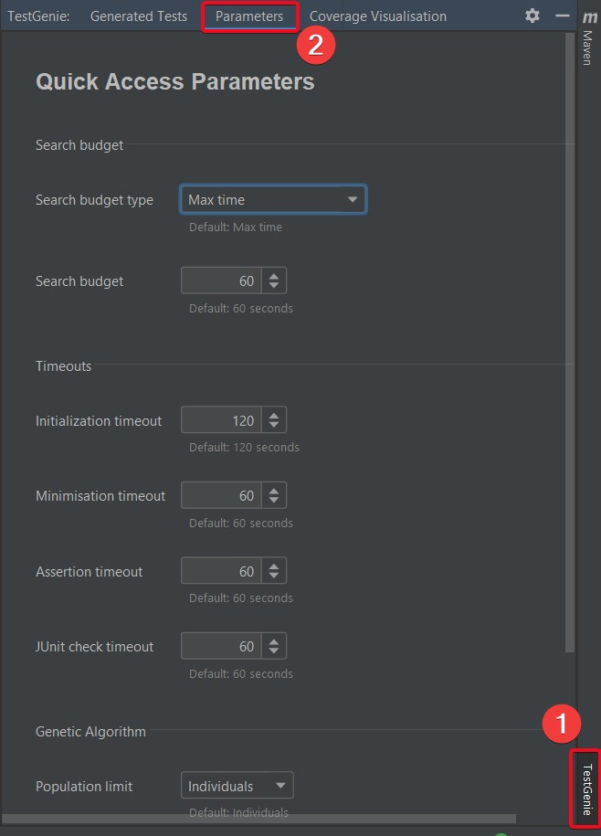\
Pro tip: don't forget to hit the "save" button at the bottom.

### Advanced Parameters
<!-- How to use Advanced Parameters Settings entry? Where to find it? What can be changed? --> 
The settings submenu `Settings` -> `Tools` -> `TestGenie` -> `EvoSuite` allows the user to tweak EvoSuite parameters to their liking. EvoSuite has hundreds of parameters, not all can be packed in a settings menu. However, the most commonly used and rational settings were added here:\
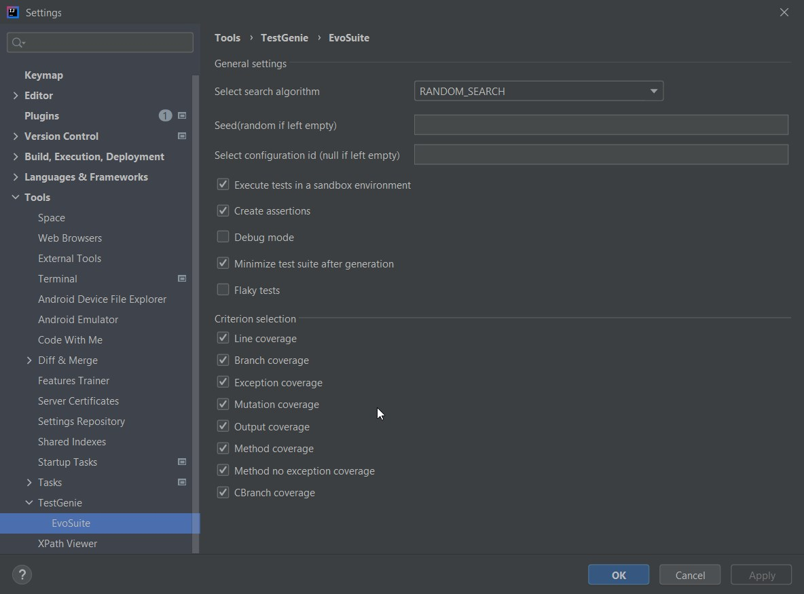

## Contribution
<!-- How to contribute to the plugin -->
The plugin is Open-Source and  publicly hosted on github. Anyone can look into the code and suggest changes. You can find the plugin page [here](https://github.com/ciselab/TestGenie). 
## Licence
<!-- Which licence does the plugin have -->

---
Plugin based on the [IntelliJ Platform Plugin Template][template].

[template]: https://github.com/JetBrains/intellij-platform-plugin-template
