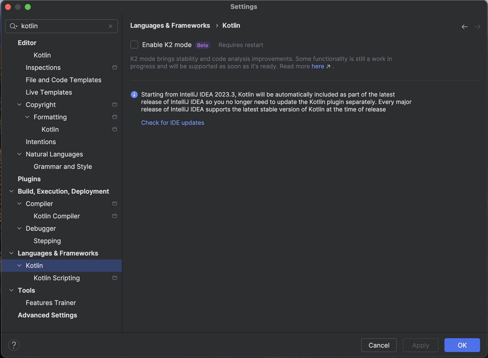

# TestSpark


[](https://plugins.jetbrains.com/plugin/21024-testspark)
[](https://plugins.jetbrains.com/plugin/21024-testspark)


## Table of contents
- [Description](#description)
- [Installation](#installation)
- [Usage](#usage)
- [TestSpark for JetBrains employees](#testspark-for-jetbrains-employees)
- [Contribution](#contribution)
- [Licence](#licence)

## Description
<!-- Plugin description -->
TestSpark is a plugin for generating unit tests. TestSpark natively integrates different AI-based test generation tools and techniques in the IDE.

TestSpark currently supports two test generation strategies:
<ul>
        <li>LLM-based test generation (using <a href="https://openai.com">OpenAI</a>, HuggingFace, and JetBrains internal AI Assistant platform)</li>
        <li>Local search-based test generation (using <a href="https://www.evosuite.org">EvoSuite</a>)</li>
</ul>
<h4>LLM-based test generation</h4>
    <p>For this type of test generation, TestSpark sends request to different Large Language Models. Also, it automatically checks if tests are valid before presenting it to users.</p>
    <p>This feature needs a token from OpenAI, HuggingFace, or the AI Assistant platform.</p>
    <ul>
        <li>Supports Java (any version) and Kotlin (K2 mode should be disabled, checkout the Settings section on README).</li>
        <li>Generates unit tests for capturing failures.</li>
        <li>Generate tests for Java classes, methods, and single lines.</li>
    </ul>

<h4>Local search-based test generation</h4>
<p>For this type of test generation, TestSpark uses <a href="https://www.evosuite.org">EvoSuite</a>, which is the  most powerful search-based local test generator. </p>
<ul>
<li>Supports up to Java 11.</li>
<li>Generates tests for different test criteria: line coverage, branch coverage, I/O diversity, exception coverage, mutation score.</li>
<li>Generates unit tests for capturing failures.</li>
<li>Generate tests for Java classes, methods, and single lines.</li>
</ul>

<p>Initially implemented by <a href="https://www.ciselab.nl">CISELab</a> at <a href="https://se.ewi.tudelft.nl">SERG @ TU Delft</a>, TestSpark is currently developed and maintained by <a href="https://lp.jetbrains.com/research/ictl/">ICTL at JetBrains Research</a>.</p>

## <span style="color:crimson; font-size:150%; font-weight:bold"> DISCLAIMER </span>
<span style="color:crimson; font-size:150%; font-weight:bold">TestSpark is currently designed to serve as an experimental tool.</span>
<span style="color:crimson; font-size:150%; font-weight:bold">Please keep in mind that tests generated by TestSpark are meant to augment your existing test suites. They are not meant to replace writing tests manually.</span>

If you are running the plugin for the first time, checkout the [Settings](#settings) section.
<!-- Plugin description end -->

## Installation
- Using IDE built-in plugin system:

  <kbd>Settings/Preferences</kbd> > <kbd>Plugins</kbd> > <kbd>Marketplace</kbd> > <kbd>Search for "TestSpark"</kbd> >
  <kbd>Install Plugin</kbd>

- Manually:

  Download the [latest release](https://github.com/ciselab/TestSpark/releases/latest) and install it manually using
  <kbd>Settings/Preferences</kbd> > <kbd>Plugins</kbd> > <kbd>⚙️</kbd> > <kbd>Install plugin from disk...</kbd>


## Usage
<!-- How to use the plugin? What are the limitations? Are there any shortcuts? -->
- [Generating Tests](#generating-tests)
- [Working with Test Cases](#working-with-test-cases)
- [Coverage](#coverage)
- [Integrating tests into the project](#integrating-tests-into-the-project)
- [Settings](#settings)
- [Disable K2 for Kotlin Test Generation](#disable-K2)
- [Telemetry](#telemetry-opt-in)

### Generating Tests
To initiate the generation process, right-click on the part of the code for which tests need to be generated and select `TestSpark`.


#### Main Page
After that, a window will open where users need to configure generation settings.


Firstly users need to select the test generator (LLM-based test generator or `EvoSuite`, which is a Local search-based test generator).


Also, in this window, it is necessary to select the part of the code for which tests need to be generated. The selection consists of no more than three items -- `class/interface`, `method/constructor` (if applicable), `line` (if applicable).


After clicking the `Next` button, the plugin provides the opportunity to configure the basic parameters of the selected generator. Advanced parameter settings can be done in Settings. All settings, both in `Settings` and in this window, are saved, so you can [disable the ability](#llm-settings) to configure generators before each generation process to perform this process more quickly.

#### LLM Setup Page
In the case of LLM, two additional pages are provided for basic settings.\
In the first page, users configure `LLM Platform`, `LLM Token`, `LLM Model`, `LLM JUnit version`, and `Prompt Selection`. More detailed descriptions of each item can be found in `Settings`.


#### LLM Samples Page
After that, in the next page, you can provide some test samples for LLM.\
Tests can be entered manually.


Also, tests can be chosen tests from the current project.


Test Cases can be modified, reset to their initial state, and deleted.


#### EvoSuite Setup Page
For `EvoSuite`, you need to enter the local path to Java 11 and select the generation algorithm, after which the generation process will start.


#### Generation Process
After configuring the test generators, click the `OK` button, after which the generation process will start, and a list of generated test cases will appear on the right side of the IDE.


During the test generation, users can observe the current state of the generation process.


### Working with Test Cases
After receiving the results, the user can interact with the test cases in various ways. They can view the result (whether it's passed or failed), also select, delete, modify, reset, like/dislike, fix by LLM and execute the tests to update the results.\
Hitting the "Apply to test suite" button will add the selected tests to a test class of your choice.\
Additionally, the top row of the tool window has buttons for selecting all tests, deselecting all tests, running all tests and removing them. The user also has an overview of how many tests they currently have selected and passed.


#### Select Test
Users can select test cases.


#### Remove Test
Users can remove test cases.


#### Modify Test
Users can modify the code of test cases.


#### Reset Test
Users can reset the code to its original.


#### Reset to Last Run
Users can reset the code to the last run.


#### Run Test
Users can run the test to update the execution result.\
Effortlessly identify passed and failed test cases with green and red color highlights for instant result comprehension is available. In case of failure, it is possible to find out the current error.


#### Copy Test
Users can copy the test.


#### Like/Dislike Test
Users can like/dislike the test for future analysis and improvement of the generation process.


#### Send a Request to LLM
Users can send a request to LLM with modification which users prefer for the test case.
Users can choose a default query, the list of which is set up in the `Settings`.


Users can also manually punch in a new request.


### Coverage
#### Coverage Table
Once a test suite is generated, basic statistics about it can be seen in the tool window, `coverage` tab. The statistics include line coverage, branch coverage, weak mutation coverage. The table adjusts dynamically - it only calculates the statistics for the selected tests in the test suite.


#### Coverage Visualisation
Once test are generated, the lines which are covered by the tests will be highlighted (default color: green). The gutter next to the lines will have a green rectangle as well. If the rectangle is clicked, a popup will show the names of the tests which cover the selected line. If any of the test names are clicked, the corresponding test in the toolwindow will be highlighted with the same accent color. The effect lasts 10 seconds. Coverage visualisation adjusts dynamically - it only shows results for the tests that are selected in the TestSpark tab.


### Integrating Tests into the Project
The tests can be added to an existing file:


Or to a new file:


### Disable K2
For LLM-based Kotlin test generation, you need to disable the K2 mode for now.

### Settings
<!-- How can users configure the plugin to match their needs? -->
The plugin is configured mainly through the Settings menu. The plugin settings can be found under <kbd>Settings</kbd> > <kbd>Tools</kbd> > <kbd>TestSpark</kbd>. Here, the user is able to select options for the plugin:


#### First time configuration
Before running the plugin for the first time, we highly recommend going to the `Environment settings` section of TestSpark settings. The settings include compilation path (path to compiled code) and compilation command. Both commands have defaults. However, we recommend especially that you check compilation command. For this command the user requires maven, gradle or any other builder program which can be accessed via command. Leaving this field with a faulty value may cause unintended behaviour.


#### Accessibility Features
The plugin supports changing the color for [coverage visualisation](#coverage-visualisation-1) and [killed mutants visualisation](#killed-mutants-visualisation-1) (one setting for both). To change the color, go to <kbd>Settings</kbd> > <kbd>Tools</kbd> > <kbd>TestSpark</kbd> and use the color picker under `Accessibility settings`:


The plugin has been designed with translation in mind. The vast majority of the plugins labels, tooltips, messages, etc. is stored in <kbd>.property</kbd> files. For more information on translation, refer to the contributing readme.

#### EvoSuite Settings
<!-- How to use Advanced Parameters Settings entry? Where to find it? What can be changed? --> 
The settings submenu <kbd>Settings</kbd> > <kbd>Tools</kbd> > <kbd>TestSpark</kbd> > <kbd>EvoSuite</kbd> allows the user to tweak EvoSuite parameters to their liking.\
At the moment EvoSuite can be executed only with Java 11, so if the user has a more modern version by default, it is necessary to download Java 11 and set the path to the java file.


To accelerate the test generation process, users can disable the display of the `EvoSuite Setup Page`.


`EvoSuite` has hundreds of parameters, not all can be packed in a settings menu. However, the most commonly used and rational settings were added here:


#### LLM Settings
The settings submenu <kbd>Settings</kbd> > <kbd>Tools</kbd> > <kbd>TestSpark</kbd> > <kbd>LLM</kbd> allows the user to tweak LLM parameters to their liking.


Selecting a platform to interact with the LLM. By default, only OpenAI is available, but for JetBrains employees there is an option to interact via Graize. More details in the [TestSpark for JetBrains employees](#testspark-for-jetbrains-employees) section.


Users have to set their own token for LLM, the plugin does not provide a default option.


Once the correct token is entered, it will be possible to select an LLM model for test generation.


In addition to the token, users are recommended to configure settings for the LLM process.


To expedite the test generation process, users can disable the display of the `LLM Setup Page`.


Additionally, they can also disable the display of the `LLM Samples Page`.


Users can customize the list of default requests to the LLM in test cases.


The plugin uses JUnit to generate tests. It is possible to select the JUnit version and prioritize the versions used by the current project.


Users have the opportunity to adjust the prompt that is sent to the LLM platform.

To create a request to the LLM, it is necessary to provide a prompt which contains information about the details of the generation. The most necessary data are located in the mandatory section, without them the prompt is not valid.\
Users can modify, create new templates, delete and use different variants in practice.


<span style="color:crimson; font-size:150%; font-weight:bold">:exclamation: Pro tip: don't forget to hit the "save" button at the bottom. :exclamation:</span>

### Telemetry (opt-in)
One of the biggest future plans of our client is to leverage the data that is gathered by TestSpark’s telemetry. This will help them with future research, including the development of an interactive way of using EvoSuite. The general idea behind this feature is to learn from the stored user corrections in order to improve test generation.\
To opt into telemetry, go to <kbd>Settings</kbd> > <kbd>Tools</kbd> > <kbd>TestSpark</kbd> and tick the `Enable telemetry` checkbox. If you want, change the directory where telemetry is stored.


## TestSpark for JetBrains employees
JetBrains employees have the ability to send queries to OpenAI models through the [Grazie platform](https://try.ai.intellij.net/chat).

### Using Grazie platform
#### Pass Space username and token as properties

1) To include test generation using Grazie in the build process, you need to pass Space username and token as properties:\
   `gradle buildPlugin -Dspace.username=<USERNAME> -Dspace.pass=<TOKEN>`.

2) To include test generation using Grazie in the runIdeForUiTests process, you need to pass Space username and token as properties:\
   `gradle runIdeForUiTests -Dspace.username=<USERNAME> -Dspace.pass=<TOKEN>`.

3) `<TOKEN>` is generated by [Space](https://jetbrains.team/), which has access to `Automatically generating unit tests` maven packages.

#### Using `gradle.properties`

Store Space username and token in `~/.gradle/gradle.properties`
```
...
spaceUsername=<USERNAME>
spacePassword=<TOKEN>
...
```

### LLM Settings with Grazie
LLM Settings with Grazie platform option:


## Contribution
<!-- How to contribute to the plugin -->
The plugin is Open-Source and  publicly hosted on github. Anyone can look into the code and suggest changes. You can find the plugin page [here](https://github.com/JetBrains-Research/TestSpark).\
In addition, learn more about the structure of the plugin [here](https://github.com/JetBrains-Research/TestSpark/blob/development/CONTRIBUTING.md).

## Licence
<!-- Which licence does the plugin have -->

---
Plugin based on the [IntelliJ Platform Plugin Template][template].

[template]: https://github.com/JetBrains/intellij-platform-plugin-template
